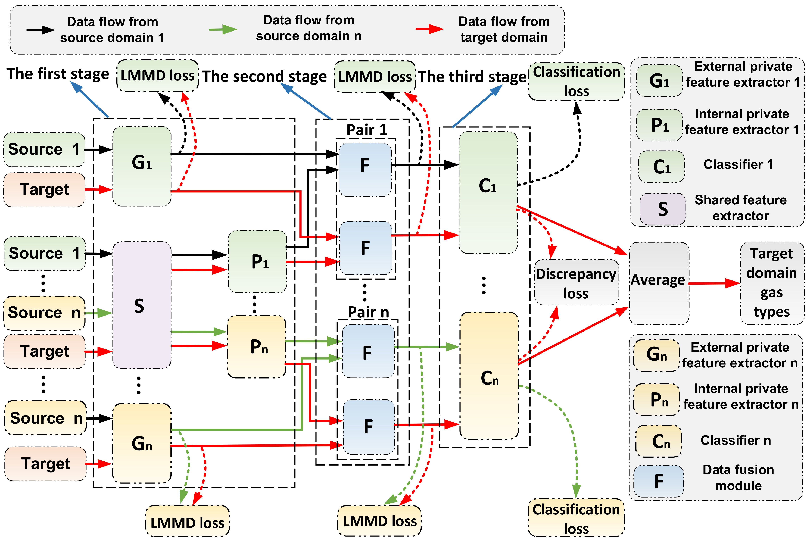
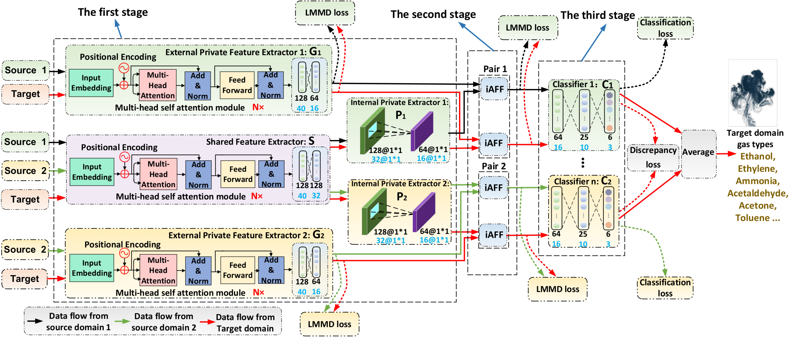

# Unsupervised Attention-Based Multi-Source Domain Adaptation Framework for Drift Compensation in Electronic Nose Systems

Fig. 1 Overview of the proposed unsupervised AMDS-PFFA model framework for drift compensation.

Fig. 2 The architecture of unsupervised AMDS-PFFA model for drift compensation.
# Introduction
The continuous, long-term monitoring of hazardous, noxious, explosive, and flammable gases in industrial environments using electronic nose (E-nose) systems is hindered by a significant challenge: the decline in gas identification accuracy caused by time-varying sensor drift. To tackle this issue, we propose a novel unsupervised attention-based multi-source domain shared-private feature fusion adaptation (AMDS-PFFA) framework for drift-compensated gas identification in E-nose systems. By leveraging labeled data from multiple source domains collected at the initial stage, the AMDS-PFFA model accurately identifies gases from unlabeled gas sensor array drift signals in the target domain. We validated the model's effectiveness through extensive experiments using the University of California, Irvine (UCI) standard drift gas dataset, collected over 36 months, and data from our self-developed E-nose system, collected over 30 months. The AMDS-PFFA model consistently outperformed recent drift compensation methods, achieving the highest average gas recognition accuracy with strong convergence—83.20% on the UCI dataset and 93.96% on our E-nose system across all target domain batches. These results highlight the superior capability of the AMDS-PFFA model in gas identification with drift compensation, significantly outperforming existing approaches.
# Getting Started
## Installation
### Configure virtual (Anaconda) environment
    
    conda create -n env_name python=3.9
    conda activate env_name
### Install Packages   
    conda install torch==2.4.0
    conda install torchvision==0.19.0
    conda install torchaudio==2.4.0
    conda install scikit-learn==1.5.1
    conda install pandas==2.2.2
    conda install matplotlib==3.9.2
    conda install matplotlib-inline==0.1.7
    conda install numpy==1.26.4
    conda install openpyxl==3.1.5
    
    or You can directly use the uploaded requirement.txt file by entering the following command：
    pip install -r requirements.txt
### Program Overview
- **folder{PCA_batch1_batch14}**：
    - ***1) pca_2d_label.py***: Code for reducing batches 1 to 14 to a 2D labeled display using PCA.
    - ***2) folder-pca_plots***: The folder designated for storing data after PCA dimensionality reduction.
- **folder{Preprocessing_UCIdrift_dataset}**:
    - ***1) maxmin_normalization.py***: Maximum and minimum normalization for UCI Batches 1 to 10.
    - ***2) maxmin_normalization.py***: Zero mean normalization for UCI batches 1 to 10.
    - ***3) batch1 to batch 10.py***: UCI Dataset can be download from https://archive.ics.uci.edu/dataset/224/gas+sensor+array+drift+dataset. In this work, we employ zero mean normalization method ()  
- **folder{data_01}**：Record the accuracy and loss curve values throughout the experiment for convergence analysis.
- **folder{data_loader}**：***data_loader.py***: Data loading code.
- **folder{ema}**：
    - ***1) ema.py***: This demonstration extracts dynamic features from drift data of the TGS2610 sensor in a gas mixture of 180 ppm CO and 180 ppm H₂. For detailed information, see Section V, subsection on experimental validation of the model using drift data from the self-developed E-nose system, and Fig. 8.
    - ***2) 180ppmH2_CO2.text***: Dynamic response signal of a mixed gas containing 180 ppm H₂ and 180 ppm CO, recorded using a self-developed electronic nose.
    - ***3) ema_data***: Save the EMA signal at $\alpha$=0.1, $\alpha$=0.01, $\alpha$=0.001.
- **folder{hsh/train_new}**：
    - ***1) Dataset_ext***: Batch1_ext ~ batch10_ext: UCI drift feature data;  batch11_ext ~ batch14_ext: self-developed E-nose drift feature data;
    - ***2) Dataset_lab***: Batch1_lab ~ batch10_lab: labels for UCI drift feature data;  batch11_ext ~ batch14_ext: labels for self-developed E-nose drift feature data;
- **folder{lmmd}**：***lmmd.py***: Code for achieving local maximum mean discrepancy.
- **folder{normalization}**：The folder designated for storing the normalized data. Execute maxmin_normalization.py and maxmin_normalization.py, and save the output to this directory.
-  **folder{pca_12_03},{pca_12_04},{pca_12_05},{pca_12_06},pca_12_07},{pca_12_08},{pca_12_09},{pca_12_10}**：Save t-SNE 2D projections of fused features from the UCI drift dataset for source-target domain pairs after applying the iAFF module. Each Excel sheet contains the corresponding t-SNE 2D projections of the fused feature data.
-   **folder{pca_1112_13},{pca_1112_14}**：Save t-SNE 2D projections of fused features from the self-developed E-nose drift dataset for source-target domain pairs after applying the iAFF module. Each Excel sheet contains the corresponding t-SNE 2D projections of the fused feature data.
- **folder{tsne_batch1_batch14}**: The folder designated for storing batch1~batch14 data after tsne dimensionality reduction.
- **folder{trained_models}**:The folder designated for storing the trained AMDS-PFFA model.
-  **{batch1_2_to_03.py, batch1_2_to_04.py, batch1_2_to_05.py, batch1_2_to_06.py, batch1_2_to_07.py, batch1_2_to_08.py, batch1_2_to_09.py, batch1_2_to_10.py}**: The main code for the AMDS-PFFA framework for the source domain batch 1 and batch 2, and the target domain batches 3 through  10 from the UCI drift dataset. 
-  **{batch11_12_to_13.py, batch11_12_to_14.py}**:  Main code for the AMDS-PFFA framework, applied to source domain batches 11 and 12, and target domain batches 13 to 14 from the self-developed E-nose drift dataset.
# Implementation
Once the required packages are installed, you can directly run the following code files: batch1_2_to_03.py, batch1_2_to_04.py, batch1_2_to_05.py, batch1_2_to_06.py, batch1_2_to_07.py, batch1_2_to_08.py, batch1_2_to_09.py, batch1_2_to_10.py, batch11_12_to_13.py, and batch11_12_to_14.py. The experimental results will be saved in the "data_01" folder. You can verify the results using the recorded accuracy and loss values.
# Available datasets
the UCI drift data and the drift data collected by the self-developed electronic nose are available at this link：
https://entuedu-my.sharepoint.com/:u:/g/personal/wenwen_zhang_staff_main_ntu_edu_sg/EVrkyHtdt1BOtIn7VhFIMAAB473tFwuWdGSUj5PrlIdFIQ?e=3MjgCx
- **batch1_ext~batch10_ext**：features of the UCI drift data.
- **batch1_lab~batch10_lab**：labels for the drift data. (1: Ethanol; 2: Ethylene; 3:Ammonia; 4: Acetaldehyde; 5: Acetone; 6: Toluene).
- **batch11_ext~batch14_ext**：features of the self-developed E-nose drift data.
- **batch11_lab~batch14_lab**：labels for the self-developed E-nose drift data. (1: CO; 2: H2; 3: CO and H2 gas mixture).
# Citation
If you find our code useful for your research, please cite our papers.

<pre> @article{c1,
  title={Unsupervised Attention-Based Multi-Source Domain Adaptation Framework for Drift Compensation in Electronic Nose Systems},
  author={Wenwen Zhang, Shuhao Hu, Zhengyuan Zhang, Yuanjin Zheng, Qi Jie Wang, Zhiping Lin},
  journal={arXiv preprint arXiv:2409.13167},
  year={2024}
} </pre>

<pre> @ARTICLE{10230866,
  author={Zhang, Wenwen and Zheng, Yuanjin and Lin, Zhiping},
  journal={IEEE Transactions on Industrial Electronics}, 
  title={Real-Time Gas Composition Identification and Concentration Estimation Model for Artificial Olfaction}, 
  year={2024},
  volume={71},
  number={7},
  pages={8055-8065},
  doi={10.1109/TIE.2023.3306402}} </pre>

# Contact
We welcome feedback, inquiries, and suggestions to improve our work. If you encounter any issues with our code or have recommendations, please don't hesitate to reach out. You can contact via email:
- wenwen.zhang@ntu.edu.sg
or alternatively, feel free to post your queries or suggestions in the Issues section of our GitHub repository.

# Acknowledgment
This code is intended solely for research purposes. Any commercial use, redistribution, or incorporation into commercial products or services is strictly prohibited without prior written permission.

We would like to thank Dr. Alexander Vergara and Shankar Vembu at the BioCircuits Institute, University of California, San Diego, for providing their dataset. If you wish to utilize this dataset, please cite the following:

[1] Vergara, A. (2012). Gas Sensor Array Drift Dataset [Dataset]. UCI Machine Learning Repository. https://doi.org/10.24432/C5RP6W.

    
    
    

  
    
   

